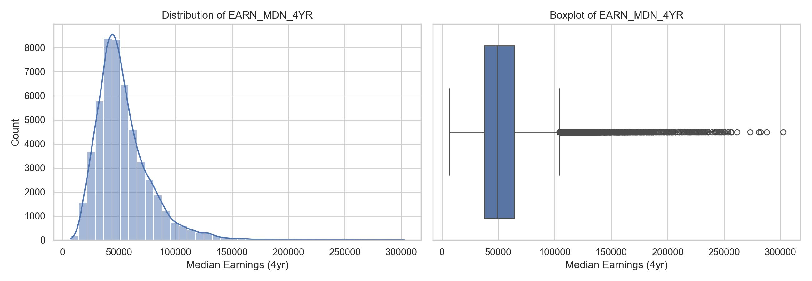
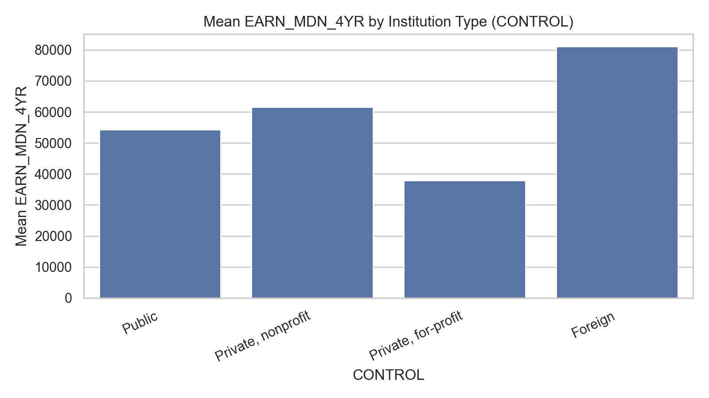
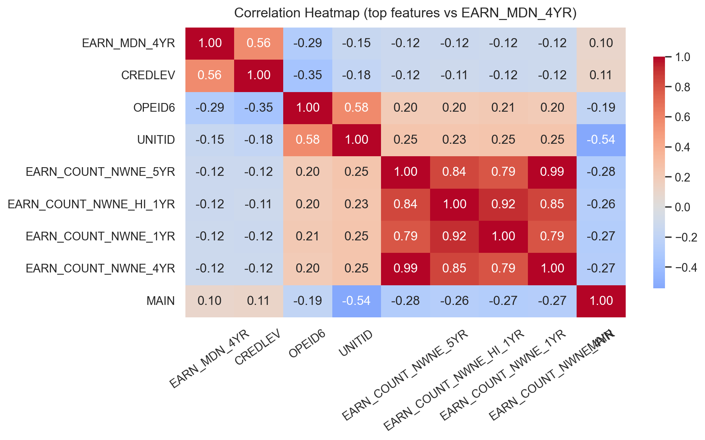
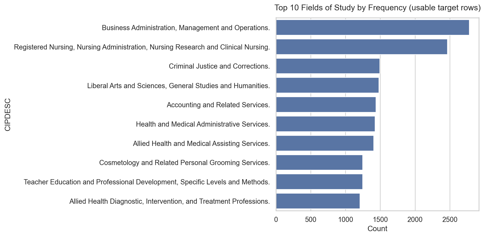
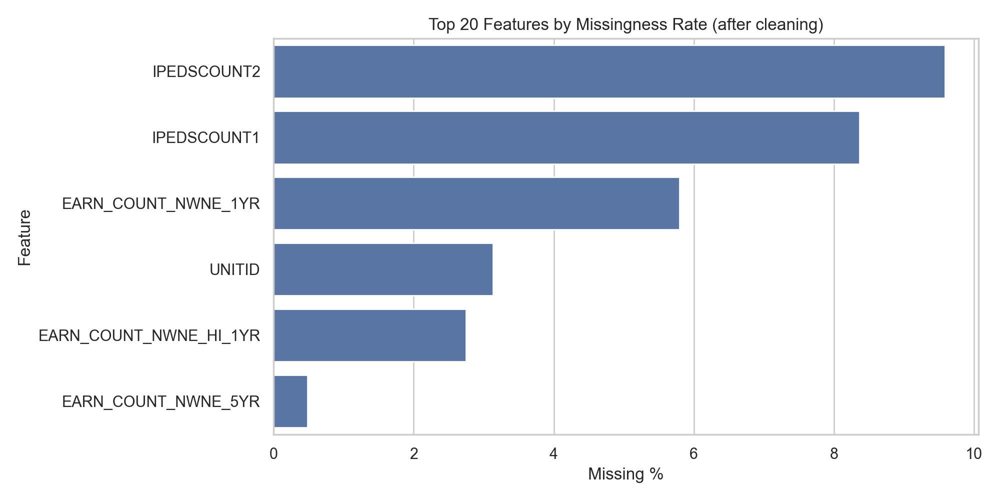
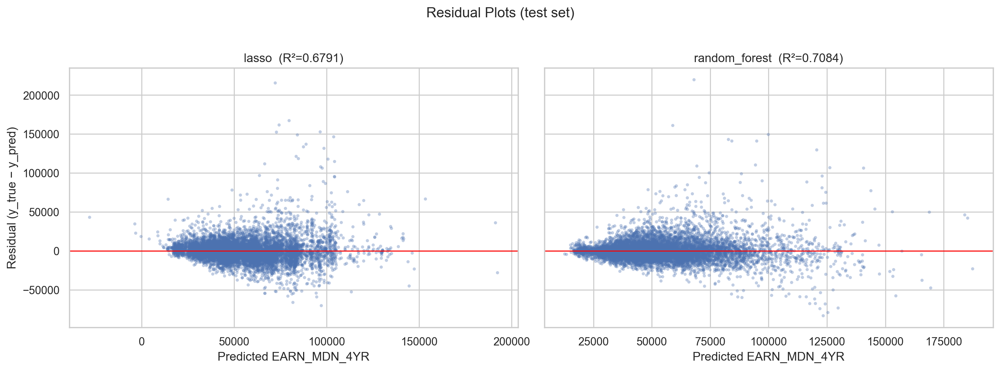
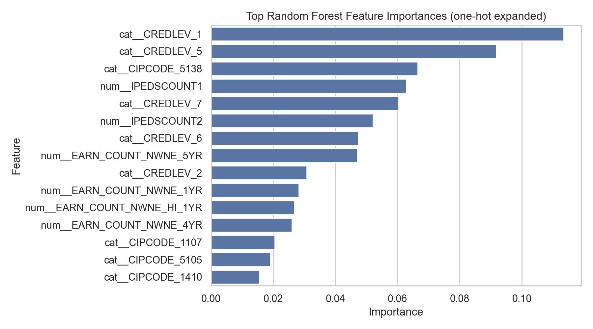

---
header-includes:
  - \usepackage{float}
  - \floatplacement{figure}{H}
---

# Milestone Report

**TA:** TBD (replace with your TA name)  
**Team Members:** Yue Yu, BingXian Xie  
**Include link to code:** `TBD`  
**Include link to video recording:** `TBD`

## Problem Description

### Machine learning problem

The goal of this project is to build a machine learning model that predicts a student/program's **median earnings four years after graduation** using features such as field of study, credential level, student debt burden, and institution characteristics. Since the target is a continuous earnings value, this is a **regression** problem.

### Why this is important (motivation)

Rising higher-education costs and student loan debt create financial uncertainty for many students after graduation. An earnings prediction model can:

- Help prospective students make more informed decisions about majors and institutions.

- Help policymakers evaluate the financial return on different academic programs.

- Improve understanding of which factors are most associated with post-graduation outcomes.

### References (related work)

The key references used to guide the project include:

- College Scorecard documentation for the Field of Study dataset and the earnings metrics used as regression targets.

- **Tibshirani (1996)** for Lasso regression and shrinkage-based feature selection.

- **Breiman (2001)** for Random Forests as a strong non-linear baseline for tabular regression.

- **Chen & Guestrin (2016)** for gradient boosted trees (XGBoost) as a powerful method for structured/tabular data.

- **Friedman (2001)** for gradient boosting foundations.

## Dataset

### Dataset source

The **College Scorecard Field of Study** dataset (program-level outcomes) is used, published by the U.S. Department of Education and publicly available at <https://collegescorecard.ed.gov/data/>. The specific file used is the most-recent-cohorts field-of-study CSV.

### Dataset statistics

For the most recent cohorts file:

- **Total records (rows):** 229,188

- **Number of features (columns):** 174

- **Target:** `EARN_MDN_4YR` (median earnings 4 years after graduation)

The dataset uses privacy suppression. In the raw CSV, the target uses a suppression token (`PS`):

- **Privacy-suppressed target rows:** 169,612 (~74.0%)

- **Other non-numeric target rows:** 8,855 (~3.9%)

- **Usable numeric target rows:** 50,721 (~22.1%)

### Feature definition and insights

The dataset contains a mixture of feature types:

- **Identifiers/labels:**
  `CIPCODE`, `CIPDESC` (field of study)

- **Institution characteristics:**
  `CONTROL`, `CREDLEV`, `DISTANCE`

- **Outcome-related predictors:**
  Debt and repayment metrics (examples used in this milestone):
    - `DEBT_ALL_STGP_ANY_MDN`
    - `BBRR2_FED_COMP_PAIDINFULL`

For this milestone, the modeling feature set consists of:

- **Numeric features:**
  `DEBT_ALL_STGP_ANY_MDN`, `BBRR2_FED_COMP_PAIDINFULL` — both have heavy suppression (missingness is high due to privacy protection).

- **Categorical features:**
  `CONTROL`, `CREDLEV`, `DISTANCE`, `CIPCODE`

### Exploratory data analysis (EDA)

Several exploratory plots are generated to understand the target distribution and relationships with key predictors.

**Figure 1.** Distribution of usable target earnings (`EARN_MDN_4YR`).

{width=95%}

**Figure 2.** Mean earnings by institution control type (`CONTROL`) using the most frequent groups.

{width=75%}

**Figure 3.** Correlation heatmap of the top numeric features against the target variable.

{width=75%}

**Figure 4.** Top fields of study by frequency (based on `CIPDESC` within usable target rows).

{width=85%}

**Figure 5.** Missingness rates for remaining features after cleaning.

{width=80%}

## Approach and methodology

### General approach

The approach follows the same structure as the proposal, adapted to the actual privacy-suppression format in the CSV:

1. **Load the full dataset** (all 174 columns) and treat privacy suppression tokens (`PS`) as missing values across all columns.

2. **Data cleaning:**

   - Auto-detect and convert numeric columns (columns where >50% of non-null values parse as numbers).
   - Remove duplicate columns (if any) and duplicate rows.
   - Drop columns where >50% of values are missing (as stated in the proposal), reducing dimensionality significantly.
   - Filter to rows where the target `EARN_MDN_4YR` is usable (not null).
   - Flag outliers in the target using the IQR method (retained for now; to be revisited if models show sensitivity).

3. **Feature selection** for modeling:

   - Numeric features: those surviving the >50% missingness threshold, excluding identifier and categorical columns.
   - Categorical features: `CONTROL`, `CREDLEV`, `DISTANCE`, `CIPCODE` (treated as categorical even though they are integer codes).

4. **Preprocess features:**

   - Numeric: median imputation + z-score scaling.
   - Categorical: most-frequent imputation + one-hot encoding.

5. **Train and evaluate regression models** using an 80/20 train/test split and compute MSE and R².

### Feature engineering / selection (planned + milestone implementation)

At this milestone, a focused feature set is used to ensure modeling works despite heavy suppression. Feature selection is ongoing; next steps will expand the feature set using:

- Missingness thresholds (drop columns with excessive missingness).

- Correlation-based pruning to reduce multicollinearity.

- Lasso-based shrinkage for feature importance.

### Machine learning models

#### Trained models

By this milestone, **two models** have been trained on a shared preprocessing pipeline:

1. **Lasso regression**

2. **Random Forest regression**

#### Preliminary results (test set)

Split: 80/20 (random_state = 42)

- **Lasso**
    - MSE: 194,171,544.67
    - R²: 0.6791

- **Random Forest**
    - MSE: 176,401,062.95
    - R²: 0.7084

**Figure 6.** Residual diagnostics (test set, side-by-side).

{width=95%}

**Figure 7.** Random Forest feature importance (top one-hot expanded features).

{width=80%}

### Challenges encountered and changes from the proposal

Key challenges and updates:

- **Privacy suppression token format:**
  The raw CSV uses the token `PS` rather than strings containing `PrivacySuppressed`, so preprocessing must explicitly map `PS` to missing.

- **Large portion of unusable target values:**
  ~74% of `EARN_MDN_4YR` entries are privacy-suppressed, leaving **50,721** usable rows for training.

- **Heavy suppression in debt/repayment predictors:**
  Some selected numeric predictors are suppressed for most rows, reducing effective information in those features.

- **Lasso convergence:**
  During training, Lasso showed a convergence warning (indicating the need for more careful regularization tuning and/or alpha selection).

These issues motivated the milestone's narrower feature subset and the use of imputation + encoding in a single unified preprocessing pipeline.

## Remaining work

1. **Expand and refine the feature set** — evaluate additional debt/repayment metrics and categorical fields; apply missingness thresholds and correlation pruning.

2. **Train the full set of regression models** — add/complete baseline linear regression (or Ridge) and Lasso tuning; train and tune tree-based models (Random Forest + XGBoost if available).

3. **Improve methodology quality** — use cross-validation for hyperparameter tuning (5-fold as planned); report additional diagnostics (residual plots by feature group, stability checks).

4. **Finalize report writing** — populate the "Discussion and Result Interpretation" portion for the final report (the milestone focuses on the required sections); produce final tables/figures comparing models and interpreting top predictors.

## Team member contribution

### Yue Yu

- Data loading and target filtering (`EARN_MDN_4YR`).
- EDA figure generation and dataset statistics reporting.
- Iterating on preprocessing decisions related to privacy suppression and missing values.

### BingXian Xie

- Modeling pipeline implementation (imputation, scaling, one-hot encoding).
- Training and evaluation of Lasso and Random Forest regressors.
- Diagnostics and interpretation artifacts (residual plots and feature-importance visualization).

## References

1. College Scorecard. Field of Study Data Documentation (includes earnings variables and privacy suppression). <https://collegescorecard.ed.gov/assets/FieldOfStudyDataDocumentation.pdf>

2. Tibshirani, R. (1996). Regression Shrinkage and Selection via the Lasso. *JRSS Series B*.

3. Breiman, L. (2001). Random Forests. *Machine Learning*.

4. Chen, T. & Guestrin, C. (2016). XGBoost: A Scalable Tree Boosting System. *KDD*. <https://arxiv.org/abs/1603.02754>

5. Friedman, J. H. (2001). Greedy Function Approximation: A Gradient Boosting Machine. *The Annals of Statistics*.
